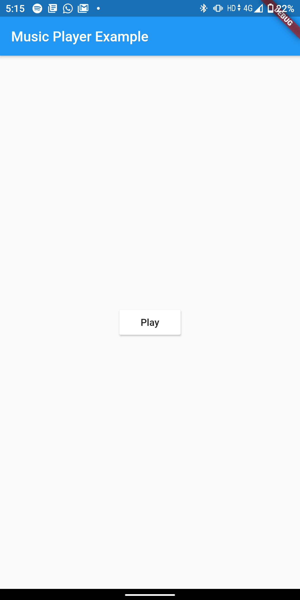
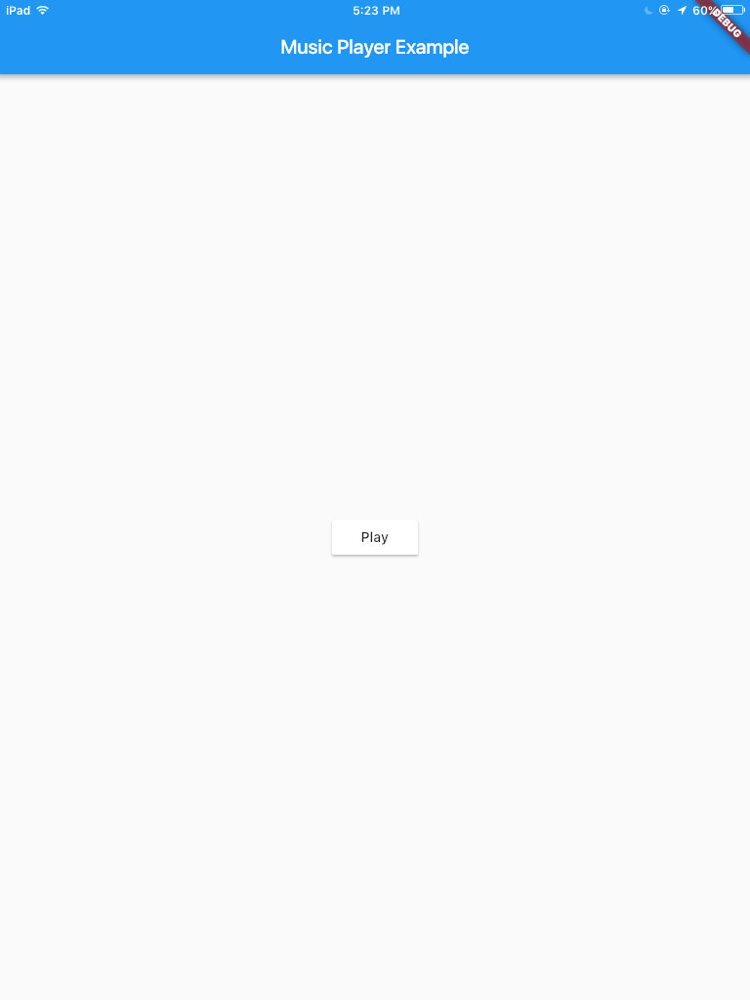

# Flutter Media Background Execution Example

This is a sample background music player app.

## Implementation

The app uses method channels to call functions written in native code; Kotlin for Android, Swift for iOS.

Method channel implementation in Flutter:

```dart
// Declaration of method channel for communication between flutter code and
// native code
MethodChannel methodChannel = MethodChannel("music");

// Variable used to setState of the Play/Stop button according to the running
// status of the music service
bool isServiceRunning;

@override
void initState() {
    isServiceRunning = false;
    super.initState();
}

//Using method channel to invoke native code to play music
void startService() async {
    bool data = await methodChannel.invokeMethod("startMusic");
    setState(() {
      isServiceRunning = data;
    });
}

//Using method channel to invoke native code to stop music
void stopService() async {
    bool data = await methodChannel.invokeMethod("stopMusic");
    setState(() {
      isServiceRunning = data;
    });
}
```

Android:

```kotlin
class MainActivity: FlutterActivity() {

    // Creating a service intent
    private lateinit var forService: Intent

    override fun onCreate(savedInstanceState: Bundle?) {
        super.onCreate(savedInstanceState)
        //Initalizing the service intent
        forService = Intent(this, MyService::class.java)

        // Method Channel implementation
        MethodChannel(flutterEngine?.dartExecutor?.binaryMessenger, "music")
                .setMethodCallHandler { call, result ->
                    when (call.method) {
                        "startMusic" -> {
                            startMusicService()
                            result.success(isServiceRunning())
                        }
                        "stopMusic" -> {
                            if (isServiceRunning()) {
                                stopService(forService)
                            }
                            result.success(isServiceRunning())
                        }
                    }
                }
    }

    override fun configureFlutterEngine(@NonNull flutterEngine: FlutterEngine) {
        GeneratedPluginRegistrant.registerWith(flutterEngine)
    }

    // Starts music service
    fun startMusicService() {
        if (Build.VERSION.SDK_INT >= Build.VERSION_CODES.O) {
            startForegroundService(forService)
        } else {
            startService(forService)
        }
    }

    // Checks whether the music service is running
    fun isServiceRunning(): Boolean {
        val manager: ActivityManager = getSystemService(Context.ACTIVITY_SERVICE) as ActivityManager
        for (service in manager.getRunningServices(Int.MAX_VALUE)) {
            print(service.service.className)
            if ("com.example.backgroundserviceexample.MyService" == service.service.className) {
                return true
            }
        }
        return false
    }
}
```

iOS:

```swift
@objc class AppDelegate: FlutterAppDelegate {

    // Declaring audio player
    var audioPlayer = AVAudioPlayer()

    override func application(
    _ application: UIApplication,
    didFinishLaunchingWithOptions launchOptions: [UIApplication.LaunchOptionsKey: Any]?
    ) -> Bool {
        
        // Defining the audio player
        do {
            audioPlayer = try AVAudioPlayer(contentsOf:
                URL.init(fileURLWithPath: Bundle.main.path(forResource: "sample", ofType: "mp3")!))
            audioPlayer.prepareToPlay()
        }
        catch {
            print(error)
        }
        
        // Setting for infinite looping of audio
        audioPlayer.numberOfLoops = -1
        
        let controller = window?.rootViewController as! FlutterViewController

        // Method channel implementation
        let channel = FlutterMethodChannel(name:"music", binaryMessenger:controller.binaryMessenger)
        channel.setMethodCallHandler({
            (call: FlutterMethodCall, result: FlutterResult) -> Void
            in
            guard call.method == "startMusic" || call.method == "stopMusic" else {
                result(FlutterMethodNotImplemented)
                return
            }
            if (call.method == "startMusic") {
                self.startMusic(result: result)
            }
            else if (call.method == "stopMusic") {
                self.stopMusic(result: result)
            }
        })

        GeneratedPluginRegistrant.register(with: self)
        return super.application(application, didFinishLaunchingWithOptions: launchOptions)
    }
    
    // Starts music
    private func startMusic(result: FlutterResult) {
        audioPlayer.play()
        result(true)
    }

    // Stops music
    private func stopMusic(result: FlutterResult) {
        // Checking if audio player is playing the audio, if so, stopping it
        if (audioPlayer.isPlaying) {
            audioPlayer.stop()
            audioPlayer.currentTime = 0
        }
        result(false)
    }
}
```

## Screenshots


*Android*



*iOS*
